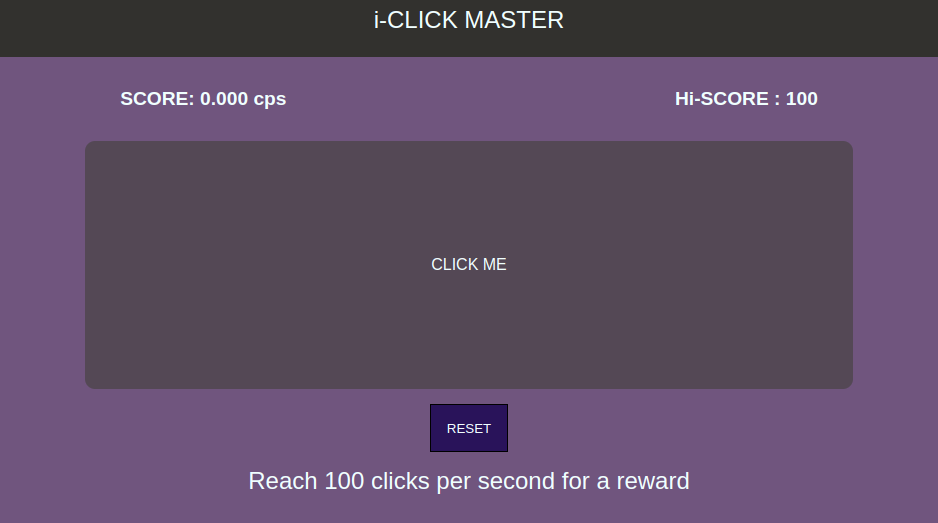

## Hi-Score

Reach 100 clicks per second for a reward.

chal.bbctf.fluxus.co.in:1003

Abrimos la URL:



Como dice la descripción, tenemos que hacer 100 clicks en 1 segundo, lo cual a mano es imposible, veamos el código fuente, en particular http://chal.bbctf.fluxus.co.in:1003/static/TheScript.js:
```javascript
(function (_0x52c9b1, _0x4f9b4c) {
	var _0x4fb32a = _0x1a8b,
		_0x216299 = _0x52c9b1();
	while (!![]) {
		try {
			var _0x3f71ce =
				(-parseInt(_0x4fb32a(0x1fa)) / 0x1) *
					(parseInt(_0x4fb32a(0x1ff)) / 0x2) +
				parseInt(_0x4fb32a(0x202)) / 0x3 +
				(parseInt(_0x4fb32a(0x201)) / 0x4) *
					(parseInt(_0x4fb32a(0x205)) / 0x5) +
				(-parseInt(_0x4fb32a(0x1fb)) / 0x6) *
					(-parseInt(_0x4fb32a(0x1f7)) / 0x7) +
				parseInt(_0x4fb32a(0x206)) / 0x8 +
				(-parseInt(_0x4fb32a(0x1f9)) / 0x9) *
					(-parseInt(_0x4fb32a(0x203)) / 0xa) +
				(parseInt(_0x4fb32a(0x208)) / 0xb) *
					(-parseInt(_0x4fb32a(0x1f6)) / 0xc);
			if (_0x3f71ce === _0x4f9b4c) break;
			else _0x216299["push"](_0x216299["shift"]());
		} catch (_0x1d9b38) {
			_0x216299["push"](_0x216299["shift"]());
		}
	}
})(_0x59a2, 0xa9a43);
var klicks = 0x0,
	score = 0x0,
	start = new Date()["getTime"](),
	end = 0x0,
	end1 = 0x1;
function _0x1a8b(_0x4264e5, _0x39be1a) {
	var _0x59a27e = _0x59a2();
	return (
		(_0x1a8b = function (_0x1a8bf4, _0x24b49c) {
			_0x1a8bf4 = _0x1a8bf4 - 0x1f4;
			var _0x117e3e = _0x59a27e[_0x1a8bf4];
			return _0x117e3e;
		}),
		_0x1a8b(_0x4264e5, _0x39be1a)
	);
}
function Clicks() {
	var _0x287a2f = _0x1a8b;
	if (klicks == 0x0) end = new Date()[_0x287a2f(0x1f5)]();
	(end1 = new Date()[_0x287a2f(0x1f5)]() - end),
		(klicks += 0x1),
		(score = (klicks / end1) * 0x3e8);
	if (score == Infinity) score = 0x0;
	(score = score[_0x287a2f(0x204)](0x3)),
		(document[_0x287a2f(0x1f4)](_0x287a2f(0x1fd))["innerHTML"] =
			_0x287a2f(0x207) + score + _0x287a2f(0x1fc));
	if (score >= 0x64) _0x125e1a();
	else document["getElementById"](_0x287a2f(0x1f8))[_0x287a2f(0x200)] = "";
	function _0x125e1a() {
		var _0x162e81 = _0x287a2f;
		document["getElementById"](_0x162e81(0x1f8))[_0x162e81(0x200)] =
			_0x162e81(0x1fe);
	}
}
function Reset() {
	(klicks = 0x0),
		(score = 0x0),
		(start = new Date()["getTime"]()),
		(end = 0x0),
		(end1 = 0x1),
		Clicks();
}
function _0x59a2() {
	var _0x78411b = [
		"\x20cps",
		"clicks",
		"\x20Your\x20Reward\x20:\x20<a\x20href=\x22" +
			"2f2e736563726574696f6e2f666c6167"
				.match(/[\da-f]{2}/gi)
				.map((h) => String.fromCharCode(parseInt(h, 16)))
				.join("") +
			"\x22\x20download=\x22flag\x22>Reward</a>",
		"3526ccMajJ",
		"innerHTML",
		"4263236HVNRoh",
		"3656895VkgrIX",
		"503210VEeXpc",
		"toFixed",
		"5NfzyuJ",
		"8399912tBbEFu",
		"SCORE:\x20",
		"6379703kdfIqT",
		"getElementById",
		"getTime",
		"48bKPhCj",
		"14Xmxuhh",
		"reward",
		"9wOTYQU",
		"597OMUzhx",
		"2046510XnQiaG",
	];
	_0x59a2 = function () {
		return _0x78411b;
	};
	return _0x59a2();
}
```
Si analizamos, se puede observar que la cantidad de clicks se almacena en la variable klicks, podemos probar usar la consola de javascript y tratar de modificar el valor, pero hace varias cosas más y el código parece estar ofuscado... pero si vemos la función _0x59a pareciera que hay un link, que pasa si la ejecutamos:

Podemos ver que el link lleva a: http://chal.bbctf.fluxus.co.in:1003/.secretion/flag

Lo cual baja un archivo llamado flag, cuyo contenido es la flag.

Flag: flag{THAtS_15_A_SM4rT_m0ve}